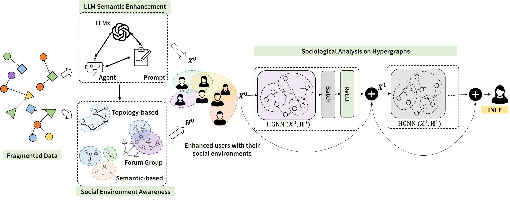

<p align="center">
    
</p>

##  Visión general

Este proyecto presenta un marco de trabajo novedoso que combina hipergrafos con modelos de lenguaje grandes (LLM) para analizar rasgos de personalidad a partir de redes sociales en línea. El proyecto tiene como objetivo superar las limitaciones de los métodos tradicionales de minería de datos, y, aprovechando las capacidades asociativas de los LLM y el potencial estructural de los hipergrafos, proporcionar un análisis más profundo del comportamiento y las interacciones de los usuarios dentro de flujos y redes sociales dinámicos en el ámbito digital.



###  Aportaciones principales

Este proyecto realiza tres contribuciones significativas al campo:

1. **Extracción de personalidad basada en prompts con LLM**: Hemos diseñado un método novedoso basado en prompts para extraer efectivamente los rasgos de personalidad de los usuarios desde modelos de lenguaje grandes.
2. **Recopilación y análisis de datos**: Realizamos una extensa recopilación y análisis de datos del foro [Personality Cafe](https://www.personalitycafe.com/), lo que permite obtener información integral sobre los perfiles y las interacciones de los usuarios.
3. **Red neuronal de hipergrafos para la simulación de redes sociales**: Proponemos un nuevo modelo que utiliza hipergrafos profundos para capturar las relaciones intrincadas entre los usuarios y sus rasgos de personalidad. Este modelo puede utilizarse para representar entornos sociales y flujos energéticos en escenarios del mundo real.

## [Conjuntos de datos](dataset/users_data_all.json)

Recopilamos un total de **85462** perfiles de usuarios de **[Personality Cafe](https://www.personalitycafe.com/)**, con la siguiente información:

- Nombres de usuario
- Tipos MBTI
- Género
- Seguidores
- Autodescripciones (sección "Acerca de mí")
- Orientación sexual
- Tipo de Enenagrama

Para agilizar el proceso, seleccionamos **17000** usuarios con información completa de seguidores, grupos, MBTI y Enenagrama para generar descripciones en lenguaje natural. El conjunto de datos se encuentra almacenado en [HuggingFace](https://huggingface.co/datasets/ZoeyShu/User_Profiles_MBTI/tree/main).

## Configuración

Para ejecutar el código, simplemente clona el repositorio e instala los paquetes requeridos:

```bash
git clone https://github.com/ZhiyaoShu/LLM-HGNN-MBTI.git
cd LLM-HGNN-MBTI
pip install -r requirements.txt
```

## Prueba de modelos preentrenados

Puedes ejecutar `test.py` para probar una [red neuronal de hipergrafos (HGNN)](https://drive.google.com/file/d/1_pG3mhSJ4cVoS1zxqi2nBbpixneXjoMj/view?usp=sharing) preentrenada con los siguientes argumentos:

```python
python test.py --test_model_path best_model_hgnn.pth 
```
También puedes probar la [red neuronal de hipergrafos plus (HGNNP)](https://drive.google.com/file/d/1eMpQEHX4Ikn5dJ3-cxkRfVGQor5MTmjF/view?usp=sharing) y cambiar la ruta `test_model_path` a `best_model_hgnnp.pth`

Ten en cuenta que asumimos que has descargado los modelos preentrenados en el directorio raíz del repositorio.

## [Entrenamiento](src/train.py)

Para entrenar un modelo, necesitas:

**- Descripciones en lenguaje natural y embeddings convertidos.**

Dado que han surgido muchos nuevos LLM después de nuestra publicación, puedes generar nuevas características con los SOTA (state-of-the-art) a partir de datos en bruto, o ejecutar con las descripciones y características generadas existentes de GPT-3.5-turbo, convertidas por sentence-transformers. Puedes descargar las descripciones y características del [conjunto de datos](dataset):

- [Descripciones generadas](dataset/gpt_description.json)

- [Embeddings convertidos](dataset/embeddings.json)

- También puedes descargar los [mapas de características procesados](https://drive.google.com/file/d/1RGQcZhEYZd0ScliGSAB077myJlosKMQe/view?usp=sharing), los cuales contienen información de usuario agregada y descripciones. 

**- Tres tipos de hiperaristas.**
Puedes descargar las hiperaristas estructuradas [aquí]([https://drive.google.com/file/d/1ILBRv44OYk8f-sSix23aU_ntHDvrif1E/view?usp=drive_link](https://drive.google.com/file/d/1Hmrs08KtHEhY6bP-nmLE-2x2PIieR255/view?usp=sharing))

Una vez que hayas preparado los pasos anteriores, puedes comenzar a entrenar el modelo con los siguientes argumentos:

```python
python train.py
```

Consulta los [argumentos del analizador](parse_arg.py) para ajustar la ruta de salida, los tipos de modelo, los epochs y otros parámetros.

## Contribuciones y Colaboraciones

Animamos a la comunidad a contribuir a este proyecto. No dudes en enviarnos comentarios, sugerir mejoras o enviar pull requests con tus ideas y cambios innovadores.

[Zhiyao Shu](https://github.com/ZhiyaoShu)
[Xiangguo Sun](https://github.com/sheldonresearch)

## Referencias

[DHG](https://deephypergraph.readthedocs.io/en/latest/index.html)
[OPENAI API](https://platform.openai.com/docs/models/gpt-3-5-turbo)
[LLAMA](https://huggingface.co/meta-llama/Llama-2-7b)
[Google Gemma](https://huggingface.co/google/gemma-7b)


## 🌹Por favor, cita nuestro trabajo si te es útil:

Thanks! / 谢谢! / ありがとう! / merci! / 감사! / Danke! / спасибо! / gracias! ...

```
@inproceedings{shu2024llm,
  title={When LLM Meets Hypergraph: A Sociological Analysis on Personality via Online Social Networks},
  author={Shu, Zhiyao and Sun, Xiangguo and Cheng, Hong},
  booktitle={Proceedings of the 33th ACM international conference on information \& knowledge management (CIKM)},
  year={2024}
}
```

Trabajos relacionados con este conjunto de datos y el grafo con análisis de personalidad social:

```
@article{sun2023self,
  title={Self-supervised hypergraph representation learning for sociological analysis},
  author={Sun, Xiangguo and Cheng, Hong and Liu, Bo and Li, Jia and Chen, Hongyang and Xu, Guandong and Yin, Hongzhi},
  journal={IEEE Transactions on Knowledge and Data Engineering},
  volume={35},
  number={11},
  pages={11860--11871},
  year={2023},
  publisher={IEEE}
}

@article{sun2022your,
  title={In your eyes: Modality disentangling for personality analysis in short video},
  author={Sun, Xiangguo and Liu, Bo and Ai, Liya and Liu, Danni and Meng, Qing and Cao, Jiuxin},
  journal={IEEE Transactions on Computational Social Systems},
  volume={10},
  number={3},
  pages={982--993},
  year={2022},
  publisher={IEEE}
}

@article{sun2020group,
  title={Group-level personality detection based on text generated networks},
  author={Sun, Xiangguo and Liu, Bo and Meng, Qing and Cao, Jiuxin and Luo, Junzhou and Yin, Hongzhi},
  journal={World Wide Web},
  volume={23},
  pages={1887--1906},
  year={2020},
  publisher={Springer}
}

@inproceedings{sun2018personality,
  title={Who am I? Personality detection based on deep learning for texts},
  author={Sun, Xiangguo and Liu, Bo and Cao, Jiuxin and Luo, Junzhou and Shen, Xiaojun},
  booktitle={2018 IEEE international conference on communications (ICC)},
  pages={1--6},
  year={2018},
  organization={IEEE}
}

```
