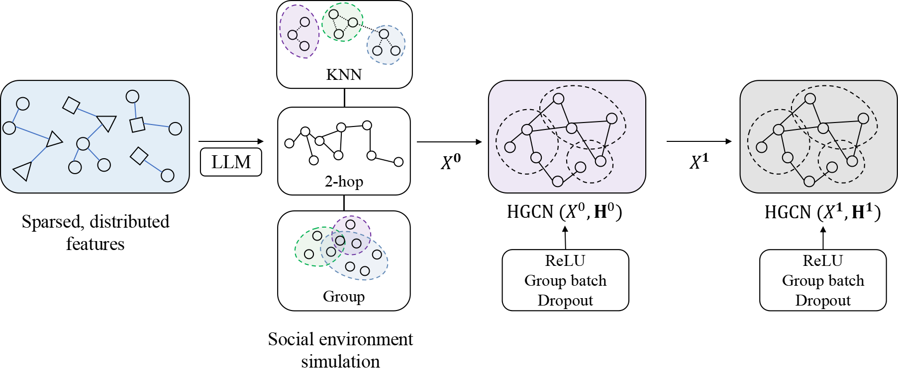

    

## Overview

This project presents a novel framework combining hypergraphs with large language models (LLMs) to analyze personality traits from online social networks, aiming to overcome the limitations of traditional data mining methods, and leveraging the associative capabilities of LLMs and the structural potential of hypergraphs to provide a more profound analysis of user behavior and interactions within dynamic flows, networks in digital realms.

### Key Contributions

This project makes three significant contributions to the field:

1. **Prompt-based Personality Extraction**: We have designed a novel prompt-based method to effectively extract users' personality traits from large language models.
2. **Data Collection and Analysis**: We performed extensive data collection and analysis from the Personality Cafe forum, enabling comprehensive insights into user profiles and interactions.
3. **Hypergraph-based Modeling**: We proposed a new model using Deep hypergraphs to capture the intricate relationships among users and their personality traits. This model can be used to depict social environments and energy flows in real-world scenarios.

## [Datasets](data/users_data_all.json)

We collected totally **85462** users profiles from **[Personality Cafe](https://www.personalitycafe.com/)**, with The dataset includes the following information:

- Usernames
- MBTI types
- Gender
- Followers
- Self-descriptions (About section)
- Sexual orientation
- Enneagram Type

We selected **17035** users with complete MBTI and Enneagram information were selected for our experiments. The dataset is available for download and can be used for research purposes.

## Framework Components

Our model architecture is divided into two primary components: Hypergraph Neural Network (HGNN) and Large Language Model (LLM). Each component plays a crucial role in processing to extract useful information from perspectives of users' data.

### LLM (Large Language Model)

Instead of applying traditional encode process, we utilized LLM generate linguistic cropus from user profiles, with two main functionalities:

- **Prompt Design**: We developed specialized prompts that facilitate the generation of detailed descriptions of users' profiles. These prompts are crafted to elicit significant personality-relevant information from the LLM.
- **Embedding Extraction**: Using the responses generated by the LLM, we extract embeddings with dense characteristics of each user profile. These embeddings are then utilized as inputs for the hypergraph model to analyze the relationships and interactions among users.

### HGNN (Hypergraph Neural Network)

- **HGNN**: This is the foundational model that uses hypergraph structures to represent and process complex relationships among users beyond simple pairwise interactions. It enables the analysis of higher-order relationships, which are crucial for understanding group dynamics and personality trait distributions.
- **HGNNP (Hypergraph Neural Network with Personality insights)**: An extension of the basic HGNN model, HGNNP incorporates additional layers and mechanisms specifically designed to integrate and leverage personality insights. This allows for more targeted and accurate modeling of social environments and interactions.

### Baseline Models

To evaluate the effectiveness of our HGNN and LLM components, we compare their performance against several well-established baseline models in the graph processing domain:

- **Graph Transformer**
- **GAT (Graph Attention Network)**
- **GNN (General Graph Neural Network)**

## Evaluation

- Accurary: The classification accuracy of the model with 500 epochs.
- F1 Score: The F1 score of the model.
- AUC: The area under the ROC curve of the model.

## Results

Within the enhancement of LLMs, the overal performance achieved a higher accuracy and F1 score compared to the baseline models. The HGNN model outperformed the other models in terms of accuracy, F1 score, and AUC.

### LLM Processed Results

| Model          | Accuracy | AUC value | F1 score | F1 score (micro) |
|----------------|----------|-----------|----------|------------------|
| **MBTI Traits**|          |           |          |                  |
| **HGNNP**      | 0.8352   | 0.9301    | 0.8187   | 0.8352           |
| **HGNN**       | 0.8659   | 0.9357    | 0.8652   | 0.8659           |
| **GAT**        | 0.7347   | 0.9206    | 0.6787   | 0.6644           |
| **Gtransformer** | 0.7051 | 0.9070    | 0.6975   | 0.7051           |
| **GCN**        | 0.7030   | 0.9071    | 0.6416   | 0.7037           |
| **Random guess**| 0.0338  | 0.0061    | 0.0069   | 0.0338           |

### One-hot Index Input Results

| Model          | Accuracy | AUC value | F1 score | F1 score (micro) |
|----------------|----------|-----------|----------|------------------|
| **MBTI Traits**|          |           |          |                  |
| **HGNNP**      | 0.8282   | 0.9266    | 0.8236   | 0.8282           |
| **HGNN**       | 0.8538   | 0.9349    | 0.8470   | 0.8538           |
| **GAT**        | 0.7641   | 0.9042    | 0.7402   | 0.7325           |
| **Gtransformer** | 0.7028 | 0.9057    | 0.6741   | 0.6900           |
| **GCN**        | 0.7002   | 0.9064    | 0.6438   | 0.7002           |
| **Random guess**| 0.0376  | 0.0082    | 0.0076   | 0.0376           |

## Contribution & Collaboration

We encourage the community to contribute to this project. Feel free to send us feedback, suggest improvements, or submit pull requests with your innovative ideas and changes.
