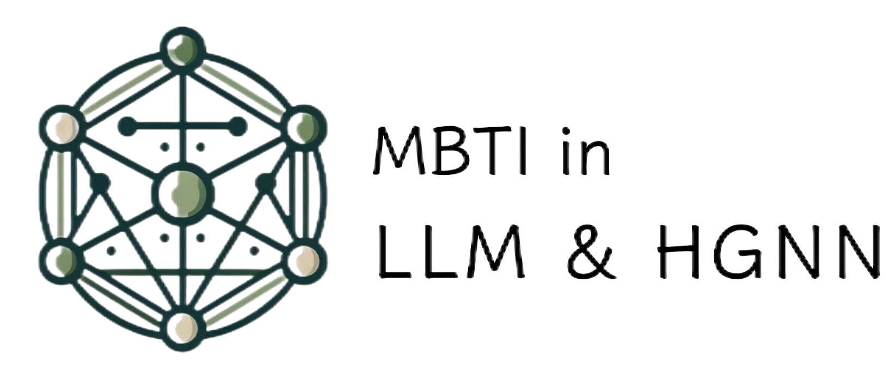
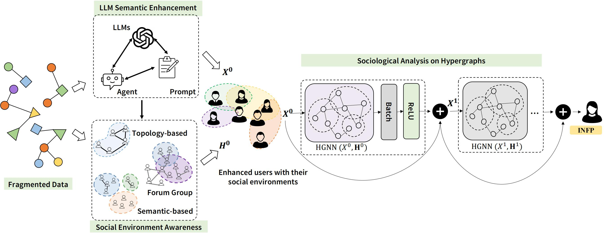

<p align="center">
    
</p>

## Overview

This project presents a novel framework combining hypergraphs with large language models (LLMs) to analyze personality traits from online social networks. The project aims to overcome the limitations of traditional data mining methods, and leveraging the associative capabilities of LLMs and the structural potential of hypergraphs to provide a more profound analysis of user behavior and interactions within dynamic social flows and networks in digital realms.



### Key Contributions

This project makes three significant contributions to the field:

1. **Prompt-based Personality Extraction with LLM**: We have designed a novel prompt-based method to effectively extract users' personality traits from large language models.
2. **Data Collection and Analysis**: We performed extensive data collection and analysis from the [Personality Cafe](https://www.personalitycafe.com/) forum, enabling comprehensive insights into user profiles and interactions.
3. **Hypergraph neural network for social network simulation**: We proposed a new model using Deep hypergraphs to capture the intricate relationships among users and their personality traits. This model can be used to depict social environments and energy flows in real-world scenarios.

## [Datasets](dataset/users_data_all.json)

We collected totally **85462** users profiles from **[Personality Cafe](https://www.personalitycafe.com/)**, with the following information:

- Usernames
- MBTI types
- Gender
- Followers
- Self-descriptions (About section)
- Sexual orientation
- Enneagram Type

To speed up, we selected **17000** users with both completed followers, groups, MBTI and Enneagram information to generate natrual-language descriptions. The dataset is stored in [data/users_data_small.csv](dataset/users_data_all.json).

## Settings

To run the code, simply clone the repository and install the required packages:

```bash
git clone https://github.com/ZhiyaoShu/LLM-HGNN-MBTI.git
cd LLM-HGNN-MBTI
pip install -r requirements.txt
```

## test pre-trained models

You can run the test.py to test a pre-trained model with following arguments:

```python
python test.py --model_path best_model.pth 
```

## [Training](src/train.py)

To train the model, you need to:

**- Natrual-language descriptions and converted embeddings.**

As many new LLMs emerged after we publish, you can either generate new features with SOTAs with row data, or run with the existed generated descriptions features from the GPT-3.5-turbo, converted by sentence-transformers. You can download the descriptions and features from [dataset](dataset):

- [Gpt-3.5-generated description](dataset/gpt_description.json)

- [Converted embeddings](dataset/embeddings.json)

- You can also downloaded [processed feature maps], which has aggregated features and 

**- Three types hyperedges.**
You can download existed hyperedges [here](https://drive.google.com/file/d/1ILBRv44OYk8f-sSix23aU_ntHDvrif1E/view?usp=drive_link)

After you prepare previous steps, you can start training the model with the following arguments:

```python
python train.py
```

Check the [parser arguments](parse_arg.py) to adjust output path, models, epoches and other parameters.

## Contribution & Collaboration

Zhiyao Shu

(DHG) [https://deephypergraph.readthedocs.io/en/latest/index.html]
(OPENAI API) [https://beta.openai.com/docs/]
(LLAMA)[]
(Google Gemma)
We encourage the community to contribute to this project. Feel free to send us feedback, suggest improvements, or submit pull requests with your innovative ideas and changes.
